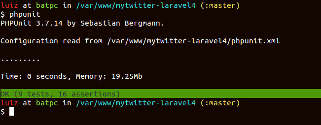
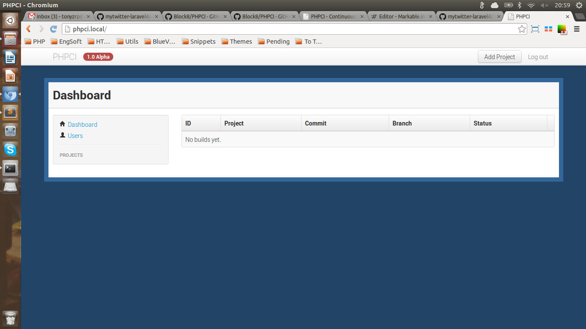
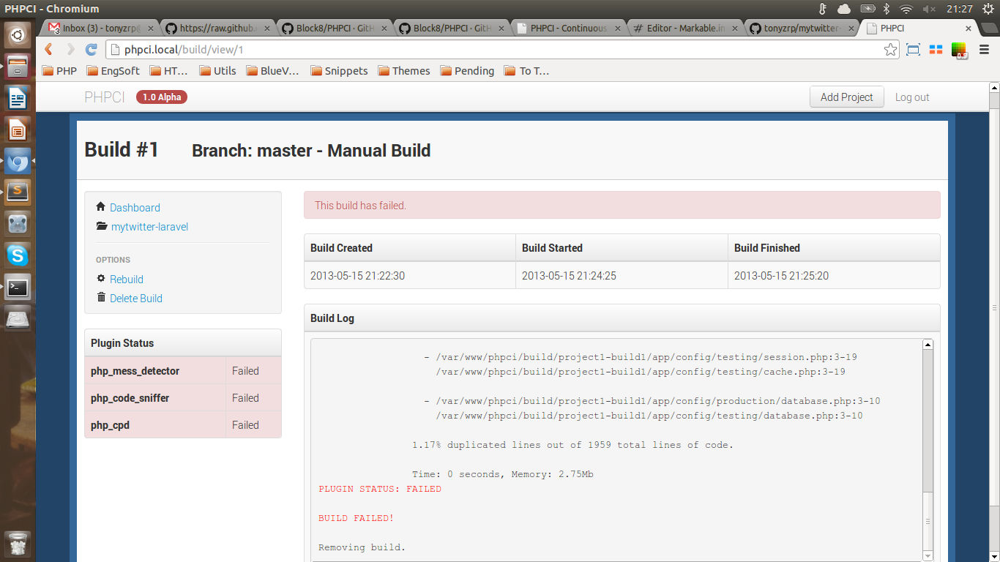
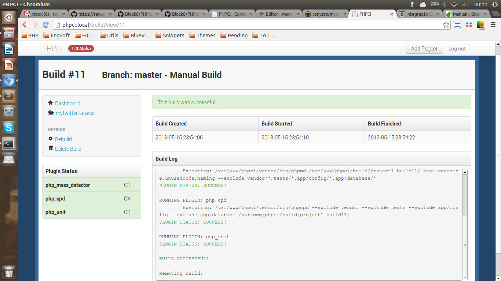

Olá! Olha aqui mais uma vez. Bom, antes de começar a falar aqui, preciso esclarecer algumas coisas. Primeiro, essa não é uma série de posts sequenciais, embora o título "parte1, parte2,..." possa sugerir isso. É apenas uma série sobre integração contínua. Na [parte 1][1] vimos uma introdução básica sobre integração contínua. Agora, vamos aplicar em um pequeno projeto meu para testes, o [MyTwitter - Laravel][2].

Nesse projeto, tenho alguns testes automatizados já configurados e rodando localmente, como podemos ver aqui:



Esse projeto já está integrado com o [Travis-CI][3], que é um serviço de integração contínua para projetos *open source*. Porém, vou aproveitar esse post para testar uma ferramenta nova, o [PHPCI][4], que parece ser bem interessante. Se quiser saber mais sobre [o que ele faz][5], [quais os requisitos][6], etc.. basta acessar o [repositório deles][7] no GitHub.

## Mãos na massa

Bom, primeiramente vamos seguir o passo a passo para instalação:

* clonar o repositório <code>git clone https://github.com/Block8/PHPCI.git</code>
* instalamos as dependências via composer: <code>composer install</code>
* permissão de execução no bin console dentro do projeto: <code>chmod +x ./console</code>
* criar o arquivo config.php: <code>echo "&lt;?php" &gt; config.php</code>
* instalação do PHPCI: <code>./console phpci:install</code>

Após esses passos, o console pedirá algumas informações para a configuração do PHPCI com o MySQL.

Depois disso, siga adiante:

* crie um VirtualHost apontando para o diretório clonado, lembre de permitir a reescrita de configurações: <code>AllowOverride All</code>
* crie um arquivo .htaccess no diretório clonado com o seguinte conteúdo

```bash
<IfModule rewrite.c>
    RewriteEngide On
    RewriteCond %{REQUEST_FILENAME} !-d
    RewriteCond %{REQUEST_FILENAME} !-f
    RewriteRule ^(.*)$ index.php [QSA,L]
</IfModule>
```

Na documentação, eles dizem para criar um cronjob para sempre executar os builds, mas vamos fazer isso manualmente.

Após essas configurações do PHPCI, você consegue acessar a página no browser, essa deve ser a home:



## Criando um projeto

Após isso, selecionamos a opção "add project" no menu superior. Ele pede algumas configurações do repositório como: URL, nome do projeto, tipo do fonte (GitHub, Bitbucket ou local).

Após adicionar o repositório, você é redirecionado para a tela do projeto no PHPCI. Antes de fazer o build, precisamos criar o arquivo de configuração do *build*, o *_config.yml* com o seguinte conteúdo:

```yml
build_settings:
    ignore:
        - "vendor"
        - "tests"

setup:
    composer:
        action: "install --dev"

test:
    php_mess_detector:
        allow_failures: true
    php_code_sniffer:
        standard: "PSR0"
    php_cpd:
        allow_failures: true
```

Após adicionar o arquivo ao repositório, estamos prontos para fazer o primeiro build.

## Primeiro Build

Para tal, o botão "build now" vai nos ajudar nessa primeira vez. Ao clicar nele, somos direcionados para a tela de visualização do build. Como você deve ter percebido, nada acontece. Isso ocorre porque não ativamos aquela *cron* que eles falam. Por isso, precisamos rodar as builds manualmente, assim:

```bash
/path/to/phpci/console phpci:run-builds
```

No melhor dos mundos, esse build deveria funcionar! Porém, meu projeto não está tão bom assim, visto que o build falhou, como podemos ver:



Após alguns ajustes no meu código, podemos ver o build funcionando:



Como vocês devem ter percebido, tive alguns problemas com o PHPCS, pois o phpci executava essa linha de comando:

```bash
RUNNING PLUGIN: php_code_sniffer
    Executing: /var/www/phpci/vendor/bin/phpcs --standard=PSR0 --ignore=vendor/*,tests/*,app/config/*,app/database/* /var/www/phpci/build/project1-build5/
        ERROR: the "PSR0" coding standard is not installed. The installed coding standards are Zend, Squiz, PHPCS, PSR2, PEAR, PSR1 and MySource
PLUGIN STATUS: FAILED
```

Só consegui fazer esse comando rodar dizendo para executar no diretório <code>./app/</code>, não no root.. e não consegui fazer isso usando o PHPCI, caso alguém consiga, compartilha ai.

## Conclusão

Após uma longa batalha para passar no QA, a build finalmente funcionou! Nesse exemplo, cada build foi executada na mão. Poderiamos usar o *cronjob* que eles sugerem, mas preferi assim, pelo menos para esse exemplo. No [Travis][3] o *build* é disparado através de um hook no github... ou seja, a cada commit na branch master (ou nas que você definir), ele faz um build novo automaticamente.

Meu dashboard até o build funcionar:


Bom, acho que é isso, galera.

Fiz alguma cagada? Deixa o comentário ai.

Até a próxima!

[1]: /2013/05/15/integracao-continua-parte-1/
[2]: https://github.com/tonyzrp/mytwitter-laravel4
[3]: http://about.travis-ci.org/docs/
[4]: http://www.phptesting.org/
[5]: https://github.com/Block8/PHPCI#what-it-does
[6]: https://github.com/Block8/PHPCI#pre-requisites
[7]: https://github.com/Block8/PHPCI
