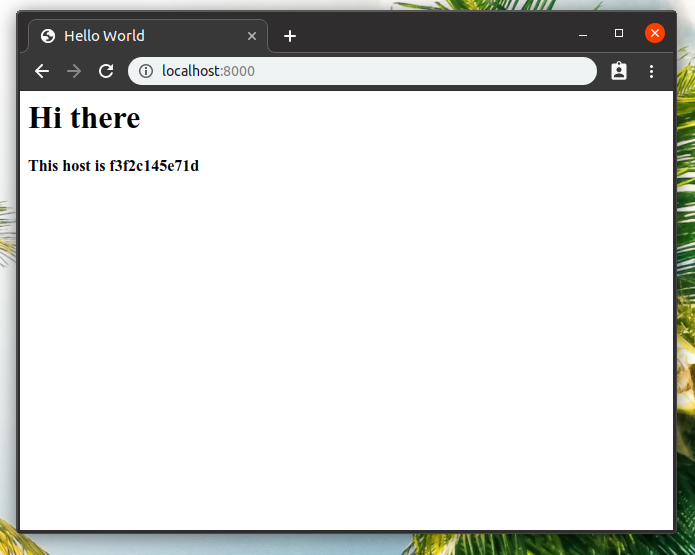
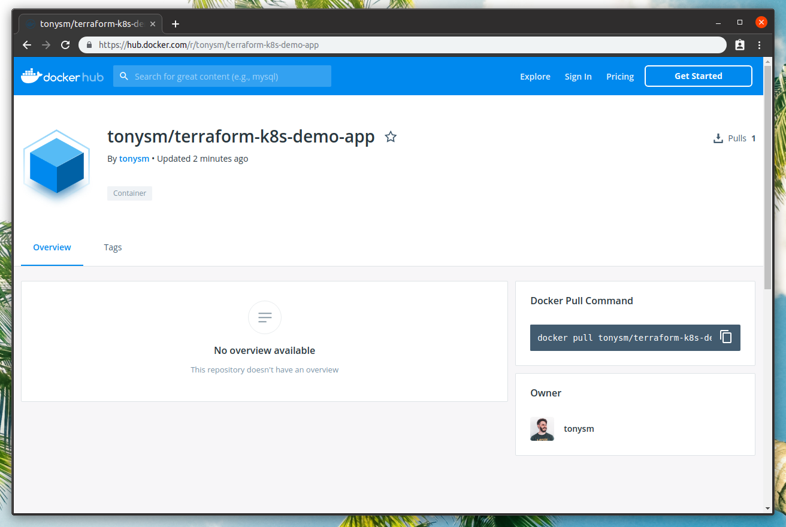
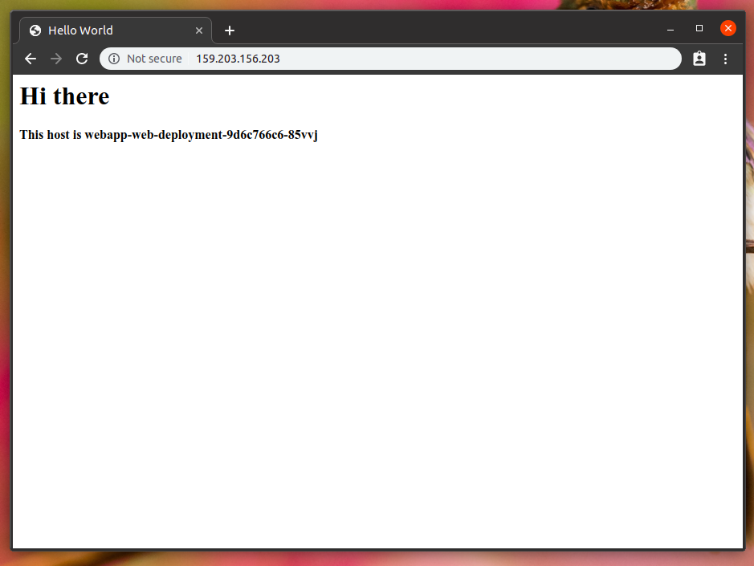

[Containers](https://www.docker.com/resources/what-container) have been in the hype for quite some time now and [Orchestrators](https://kubernetes.io/en/) have enabled us to shift the way we deploy software from task runners to something more declarative way. In this article, we are exploring that and going a bit further by also setting up our infrastructure in a declarative way using HashiCorp's [Terraform](https://www.terraform.io/).

## Requirements

You will need some tools installed, make sure you have them on your local machine:

- [Docker](https://docs.docker.com/install/)
- Kubernetes' [kubectl](https://kubernetes.io/docs/tasks/tools/install-kubectl/)
- Digital Ocean's [doctl](https://github.com/digitalocean/doctl#installing-doctl)
- A Digital Ocean account

## Containerizing a Demo PHP Application

First of all, we are going to start from scratch here, so let's create the folder that will wrap all of our files:

```bash
mkdir php-terraform-kubernetes-example/
```

Great! From now on, we are calling this folder *the root path*.

Now, let's create the World's simplest PHP application. Add a `index.php` file under `<root>/app/public/` and paste the following code:

```php
<html lang="en">
    <head>
        <title>Simplest PHP APP</title>
    </head>
    <body>
        <h1>Hello, World!</h1>
        <h3>From host: <?= gethostname(); ?></h3>
    </body>
</html>
```

Since having PHP installed wasn't a requirement, we are going to use Docker to test this application. For that, let's create the World's worst PHP Dockerfile. Create a `Dockerfile` inside `<root>/app/` with the following content:

```dockerfile
FROM php:7.3

WORKDIR /app

COPY . /app

CMD ["php", "-S", "0.0.0.0:80", "-t", "public/"]
```

This Dockerfile describes how we want our Docker image to look like. It contains all the steps to create (and recreate) the Docker image for our containers. Let's dissect the lines instructions on it:

- `FROM php:7.3`: This tells Docker that our application Docker image is based on the official PHP image for the 7.3 version. Official images do not require an organization/username prefix and can be found in the default Docker Registry - [Docker Hub](https://hub.docker.com/);
- `WORKDIR /app`: This sets the path `/app` inside our container as the working directory, which means that any command running inside the container will from this directory as context;
- `COPY . /app`: This copies all files from the *context* path to the `/app` path inside the container;
- `CMD ...`: This is the default command that the container will run. We can override this at *runtime*, but that's out of the scope of this article.

Alright, with that covered, let's build our custom Docker image by running the following command:

```bash
docker build -t tonysm/demo-php-app:0.0.1 -f app/Dockerfile ./app
Sending build context to Docker daemon  3.584kB
Step 1/4 : FROM php:7.3
 ---> f0357c41bff5
Step 2/4 : WORKDIR /app
 ---> Using cache
 ---> fac311810559
Step 3/4 : COPY . /app
 ---> Using cache
 ---> 88f78910921e
Step 4/4 : CMD ["php", "-S", "0.0.0.0:80", "-t", "public/"]
 ---> Using cache
 ---> 1165b21c4c06
Successfully built 1165b21c4c06
Successfully tagged tonysm/terraform-k8s-demo-app:0.0.1
```

Here's a poor explanation of what is going on here:


Great. Our image was successfully built. You can find your Docker image in your local images with the following command:

```bash
docker image ls | grep tonysm/terraform
tonysm/terraform-k8s-demo-app                  0.0.1                    e522d9fbc93b        5 seconds ago       367MB
```

Nice, let's run this image locally to test it out:

```bash
docker run -p 8000:80 tonysm/terraform-k8s-demo-app:0.0.1
```

No output, which (in this case) means it's working. Open [http://localhost:8000](http://localhost:8000) in your browser and you should see something like this:



Great! Now, let's push this image to Docker Hub. You need to create an account there, so go ahead, I'll wait.

Now that you have an account in Docker Hub, you also need to authenticate you local Docker CLI running `docker login` and typing your credentials there. After that, we can now push our image to Docker Hub with:

```bash
docker push tonysm/terraform-k8s-demo-app:0.0.1
The push refers to repository [docker.io/tonysm/terraform-k8s-demo-app]
0e017f123496: Pushed 
5bcce6289196: Pushed 
5e63a0adbe83: Mounted from tonysm/dummy-php-image 
82c280d40dc6: Mounted from tonysm/dummy-php-image 
07886e8b1870: Mounted from tonysm/dummy-php-image 
e01f9f2bc3a7: Mounted from tonysm/dummy-php-image 
4625f667b473: Mounted from tonysm/dummy-php-image 
0318b3b010ef: Mounted from tonysm/dummy-php-image 
d7b30b215a88: Mounted from tonysm/dummy-php-image 
9717e52dd7bd: Mounted from tonysm/dummy-php-image 
cf5b3c6798f7: Mounted from tonysm/dummy-php-image 
0.0.1: digest: sha256:27f939f99c2d57ca690a5afdc8de2afe0552b851d0c38213603addd1f6bba323 size: 2616
```

In my case, some of the steps were already present in another image in my user account, so Docker knows that and doesn't have to push the same layers again. If you open your profile on Docker Hub, the image will be there, **publicly available to anyone**:



Great. Now, let's create our Kubernetes Cluster.

## Terraforming our Infrastructure on DigitalOcean

Since we are using DigitalOcean, we could go to their Dashboard and spin up a Kubernetes Cluster from there. But, let's make it more interesting by using Terraform to do that for us. It will build the Kubernetes Cluster for us and later we can deploy our application to it.

Let's start by creating the folder `<root>/provision/` in our app (`mkdir provision/`). Terraform doesn't require any file naming convention, it will load any file ending with `*.tf` in our folder, so let's create a `main.tf` file with the following content:

```terraform
provider "digitalocean" {
  token = var.do-token
}

// Kubernetes cluster with 3 nodes.
resource "digitalocean_kubernetes_cluster" "terraform-k8s-demo-app" {
  name    = "terraform-k8s-demo-app"
  region  = "nyc1"
  version = "1.14.2-do.0"

  node_pool {
    name       = "terraform-k8s-demo-app-pool"
    size       = "s-2vcpu-2gb"
    node_count = 1
  }
}
```

I'm not going over line-by-line on what is going on here, just know that we are telling Terraform that we are using the digitalocean provider, and that gives us some resource types we can use, one of them is the *digitalocean_kubernetes_cluster* that creates the cluster for us with, in this case, 1 node (see the `node_count` definition). If you want to learn more, [the documentation](https://www.terraform.io/intro/index.html) is a wonderful place.

This file requires the existing of a variable, the `var.do-token`, let's create a `variables.tf` file:

```terraform
variable "do-token" {
  default = "(YOUR DIGITAL OCEAN TOKEN)"
}
```

Make sure this file is ignored on Git, you do not want to share your Digital Ocean token. Now, let's initialize our Terraform client:

```bash
cd provision/
terraform init

Initializing the backend...

Initializing provider plugins...

The following providers do not have any version constraints in configuration,
so the latest version was installed.

To prevent automatic upgrades to new major versions that may contain breaking
changes, it is recommended to add version = "..." constraints to the
corresponding provider blocks in configuration, with the constraint strings
suggested below.

* provider.digitalocean: version = "~> 1.4"

Terraform has been successfully initialized!

You may now begin working with Terraform. Try running "terraform plan" to see
any changes that are required for your infrastructure. All Terraform commands
should now work.

If you ever set or change modules or backend configuration for Terraform,
rerun this command to reinitialize your working directory. If you forget, other
commands will detect it and remind you to do so if necessary.
```

Great. Now, let's use Terraform to make a plan of action to build the infrastructure:

```bash
terraform plan -out /tmp/plan

Refreshing Terraform state in-memory prior to plan...
The refreshed state will be used to calculate this plan, but will not be
persisted to local or remote state storage.


------------------------------------------------------------------------

An execution plan has been generated and is shown below.
Resource actions are indicated with the following symbols:
  + create

Terraform will perform the following actions:

  # digitalocean_kubernetes_cluster.terraform-k8s-demo-app will be created
  + resource "digitalocean_kubernetes_cluster" "terraform-k8s-demo-app" {
      + cluster_subnet = (known after apply)
      + created_at     = (known after apply)
      + endpoint       = (known after apply)
      + id             = (known after apply)
      + ipv4_address   = (known after apply)
      + kube_config    = (known after apply)
      + name           = "terraform-k8s-demo-app"
      + region         = "nyc1"
      + service_subnet = (known after apply)
      + status         = (known after apply)
      + updated_at     = (known after apply)
      + version        = "1.14.2-do.0"

      + node_pool {
          + id         = (known after apply)
          + name       = "terraform-k8s-demo-app-pool"
          + node_count = 1
          + nodes      = (known after apply)
          + size       = "s-2vcpu-2gb"
        }
    }

Plan: 1 to add, 0 to change, 0 to destroy.

------------------------------------------------------------------------

This plan was saved to: /tmp/plan

To perform exactly these actions, run the following command to apply:
    terraform apply "/tmp/plan"

```

Terraform gives us what it *plans* to do in our infrastructure. It's our job to validate if everything looks ok. For this example, I think it's fine, let's apply this plan:

```bash
terraform apply /tmp/plan
digitalocean_kubernetes_cluster.terraform-k8s-demo-app: Creating...
digitalocean_kubernetes_cluster.terraform-k8s-demo-app: Still creating... [10s elapsed]
digitalocean_kubernetes_cluster.terraform-k8s-demo-app: Still creating... [20s elapsed]
digitalocean_kubernetes_cluster.terraform-k8s-demo-app: Still creating... [30s elapsed]
digitalocean_kubernetes_cluster.terraform-k8s-demo-app: Still creating... [40s elapsed]
digitalocean_kubernetes_cluster.terraform-k8s-demo-app: Still creating... [50s elapsed]
digitalocean_kubernetes_cluster.terraform-k8s-demo-app: Still creating... [1m0s elapsed]
digitalocean_kubernetes_cluster.terraform-k8s-demo-app: Still creating... [1m10s elapsed]
digitalocean_kubernetes_cluster.terraform-k8s-demo-app: Still creating... [1m20s elapsed]
digitalocean_kubernetes_cluster.terraform-k8s-demo-app: Still creating... [1m30s elapsed]
digitalocean_kubernetes_cluster.terraform-k8s-demo-app: Still creating... [1m40s elapsed]
digitalocean_kubernetes_cluster.terraform-k8s-demo-app: Still creating... [1m50s elapsed]
digitalocean_kubernetes_cluster.terraform-k8s-demo-app: Still creating... [2m0s elapsed]
digitalocean_kubernetes_cluster.terraform-k8s-demo-app: Still creating... [2m10s elapsed]
digitalocean_kubernetes_cluster.terraform-k8s-demo-app: Still creating... [2m20s elapsed]
digitalocean_kubernetes_cluster.terraform-k8s-demo-app: Still creating... [2m30s elapsed]
digitalocean_kubernetes_cluster.terraform-k8s-demo-app: Still creating... [2m40s elapsed]
digitalocean_kubernetes_cluster.terraform-k8s-demo-app: Still creating... [2m50s elapsed]
digitalocean_kubernetes_cluster.terraform-k8s-demo-app: Still creating... [3m0s elapsed]
digitalocean_kubernetes_cluster.terraform-k8s-demo-app: Still creating... [3m10s elapsed]
digitalocean_kubernetes_cluster.terraform-k8s-demo-app: Still creating... [3m20s elapsed]
digitalocean_kubernetes_cluster.terraform-k8s-demo-app: Still creating... [3m30s elapsed]
digitalocean_kubernetes_cluster.terraform-k8s-demo-app: Still creating... [3m40s elapsed]
digitalocean_kubernetes_cluster.terraform-k8s-demo-app: Still creating... [3m50s elapsed]
digitalocean_kubernetes_cluster.terraform-k8s-demo-app: Still creating... [4m0s elapsed]
digitalocean_kubernetes_cluster.terraform-k8s-demo-app: Still creating... [4m10s elapsed]
digitalocean_kubernetes_cluster.terraform-k8s-demo-app: Still creating... [4m20s elapsed]
digitalocean_kubernetes_cluster.terraform-k8s-demo-app: Still creating... [4m30s elapsed]
digitalocean_kubernetes_cluster.terraform-k8s-demo-app: Still creating... [4m40s elapsed]
digitalocean_kubernetes_cluster.terraform-k8s-demo-app: Creation complete after 4m44s [id=81ee8486-51cb-48da-811c-14d6b3346f7d]

Apply complete! Resources: 1 added, 0 changed, 0 destroyed.

The state of your infrastructure has been saved to the path
below. This state is required to modify and destroy your
infrastructure, so keep it safe. To inspect the complete state
use the `terraform show` command.

State path: terraform.tfstate
```

Great. This means our Kubernetes cluster was successfully created on Digital Ocean. You can open up your Dashboard and see the cluster as well as the nodes, but let's use the `doctl` CLI tool for that. To start, you need to authenticate with your Digital Ocean token:

```bash
doctl auth init
```

And paste your Digital Ocean token. Now, let's list our Kubernetes:

```bash
doctl kubernetes cluster list
ID                                      Name                      Region    Version        Auto Upgrade    Status     Node Pools
81ee8486-51cb-48da-811c-14d6b3346f7d    terraform-k8s-demo-app    nyc1      1.14.2-do.0    false           running    terraform-k8s-demo-app-pool
```

Nice. Let's connect our local `kubectl` to that remote cluster:

```bash
doctl kubernetes cluster kubeconfig save 81ee8486-51cb-48da-811c-14d6b3346f7d
Notice: adding cluster credentials to kubeconfig file found in "/home/tony/.kube/config"
Notice: setting current-context to do-nyc1-terraform-k8s-demo-app
```

From now on we are doing any command we run with `kubectl` in our cluster, like:

```bash
kubectl cluster-info
Kubernetes master is running at https://81ee8486-51cb-48da-811c-14d6b3346f7d.k8s.ondigitalocean.com
CoreDNS is running at https://81ee8486-51cb-48da-811c-14d6b3346f7d.k8s.ondigitalocean.com/api/v1/namespaces/kube-system/services/kube-dns:dns/proxy

To further debug and diagnose cluster problems, use 'kubectl cluster-info dump'.
```

Cool. Now, let's deploy our application on this Kubernetes Cluster.

## Deploying our Demo PHP Application on Kubernetes

We already have our image on Docker Hub (our registry), so we only have to create our Kubernetes Objects' manifests. If you are new to Kubernetes, I did an attempt to explain what these are in this [blogpost](https://madewithlove.be/kubernetes-101-the-basics/), but also check the [docs](https://kubernetes.io/docs/concepts/overview/working-with-objects/kubernetes-objects/).

For our application, we will need:

- A deployment object for the web (our application);
- A service object to represent load balance requests to our webapp PODs.

Now, create the folder `<root>/k8s/`, there you can create the file `webapp.yml` with the following contents:

```yaml
apiVersion: apps/v1
kind: Deployment
metadata:
  labels:
    app: webapp-web
  name: webapp-web-deployment
spec:
  replicas: 2
  selector:
    matchLabels:
      app: webapp-web
  template:
    metadata:
      labels:
        app: webapp-web
    spec:
      containers:
        - image: tonysm/terraform-k8s-demo-app:0.0.1
          name: webapp-web-deployment
          ports:
            - containerPort: 80
              name: http
---
apiVersion: v1
kind: Service
metadata:
  name: webapp
spec:
  type: LoadBalancer
  ports:
    - port: 80
      targetPort: http
  selector:
    app: webapp-web
```

Let's take the time to talk about what we have here. This file contains 2 Kubernetes Objects separated by the triple dashes (---). First one is a Deployment Object. This is typically the type of object you use on your applications. With this kind of object, Kubernetes handles the rollout of new images (you can control the deploy strategy, but by default it is RollingUpdate, which will terminate existing PODs while creating the new ones whenever you *apply* a new image. The important pieces are:

- `.spec.replicas: 2`: tells we want 2 PODs running;
- `.spec.selector.matchLabels.app: webapp-web`: is what this deployment will use to "watch" how many PODs are running, so Kubernetes can control the desired amount of PODs for us;
- `.spec.template`: is the the template that will be used to create the PODs. You can think of it as a POD object definiton (I'm not sure if they call it that, but it's easier for me to think like that);
- `.spec.template.metadata.labels.app: webapp-web`: is very important! This is what the deployment uses in the matchLabels defition above. The deployment use the label in this template to match with the selector to make sure it has the desired amount of running PODs for this deployment in our Cluster. This is also used when we scale down or up our PODs;
- `.spec.template.spec.containers[0].image: tonysm/terraform-k8s-demo-app:0.0.1`: is the container image used by this POD (techinically we can have more than one container for a single POD, but that's rarely needed, tbh);
- `.spec.template.spec.containers[0].ports[0].containerPort: 80`: is the port this container is expecting requests;
- `.spec.template.spec.containers[0].ports[0].name: http`: is an alias for this port, we are using it later to reference this port instead of the number.

Alright, let's cover the service portion now. Services in Kubernetes are load-balancers that can be used to distribute load for our containers. They serve as a central reference for the PODs under it. For instance, if you have another application that talks to this application, you wouldn't have to point it to a POD. Actually, since PODs are ephemeral (like containers), this would be hard to manage. You can, however, point that application to the service instead, and the service would be responsible to send the request to the correct POD. Important pieces here are:

- `.spec.ports[0].port: 80`: this is the port the service is expecting requests on;
- `.spec.ports[0].targetPort: http`: this is the named port in our POD container the service will be sending these requests to (remember we named the container port in the Deployment template? That one);
- `.spec.selector.app: webapp-web`: this is the label used by the service to identify the PODs that are behind it.

There is one more caveat here. When you use a service of type LoadBalancer in the DigitalOcean Kubernetes cluster, DigitalOcean will assign an exctual LoadBalancer (Ingress) that points to your service. This way, you will get a public IP bound to this service that you can use in your DNS config.

Enough talking, let's apply this object to our cluster:

```bash
kubectl apply -f k8s/
deployment.apps/webapp-web-deployment created
service/webapp created
```

Great. Everything seems to be working. Let's wait a bit, because the service takes some time to create the LB for us. You can get the public IP either in the DigitalOcean dashboard or via CLI:

```bash
kubectl get svc -w
NAME         TYPE           CLUSTER-IP       EXTERNAL-IP   PORT(S)        AGE
kubernetes   ClusterIP      10.245.0.1       <none>        443/TCP        7m55s
webapp       LoadBalancer   10.245.144.120   <pending>     80:30808/TCP   10s
webapp       LoadBalancer   10.245.144.120   159.203.156.203   80:30808/TCP   28m
```

Now, if you open [159.203.156.203](http://159.203.156.203) on your browser, you should see our application running on DigitalOcean!


If you refresh, you can see the hostname changed!



This is because we have 2 replicas of the POD running in the cluster, as you can see with the following command:

```bash
kubectl get pods
NAME                                    READY   STATUS    RESTARTS   AGE
webapp-web-deployment-9d6c766c6-85vvj   1/1     Running   0          32m
webapp-web-deployment-9d6c766c6-bnbpj   1/1     Running   0          32m
```

Pretty cool, right?!

## Cleaning up

You probably don't want to keep this running on your DigitalOcean account, so let's clean up. First of all, let's delete the things we create via Kubernetes:

```bash
kubectl delete -f k8s/
deployment.apps "webapp-web-deployment" deleted
service "webapp" deleted
```

Alright, this should get rid of our PODs, deployments, replicasets, services, and, more importantly, our LoadBalancer that was assigned to the running service.

Next, let's use terraform to delete the kubernetes cluster and running nodes for us:

```bash
cd provision/
terraform destroy
...
Plan: 0 to add, 0 to change, 1 to destroy.

Do you really want to destroy all resources?
  Terraform will destroy all your managed infrastructure, as shown above.
  There is no undo. Only 'yes' will be accepted to confirm.

  Enter a value: yes

digitalocean_kubernetes_cluster.terraform-k8s-demo-app: Destroying... [id=37b9cb67-d8cc-468d-a017-2102c2d87246]
digitalocean_kubernetes_cluster.terraform-k8s-demo-app: Destruction complete after 1s

Destroy complete! Resources: 1 destroyed.
```

Everything was erased (it might take a few seconds for things to disapear from your Digital Ocean dashboard).

## Wrapping up

Alright, that was a long ride. After all this, this should be your current file structure:

```bash
tree .
.
├── app
│   ├── Dockerfile
│   └── public
│       └── index.php
├── k8s
│   └── web.yml
└── provision
    ├── main.tf
    ├── terraform.tfstate
    ├── terraform.tfstate.backup
    └── variables.tf

3 directories, 7 files
```

The `terraform.tfstate` inside the `provision/` folder is where terraform keeps your infrastructure state (ips, resources creates, things like that). When you are working on a team, you probably want that state not on your local machine, but living somewhere where your team mates can also use to manage the cluster. That can be achieved by using a share S3 bucket in your [backend](https://www.terraform.io/docs/backends/index.html). If you are using Digital Ocean, they have a service called Spaces, which can also be used instead of AWS S3, as they implement the same protocols.

That's it for now, I hope I have sparked some interest to you on the topic. This declarative way of doing things is becoming way more common these days, and it's everywhere: on your frontend ([React](https://dev.to/itsjzt/declarative-programming--react-3bh2) and [Vue](https://vuejs.org/v2/guide/#Declarative-Rendering)), as well as in your infrastructure.

This also enables a thing we are going to talk about next: [GitOps](https://www.weave.works/technologies/gitops/).

See you soon!
